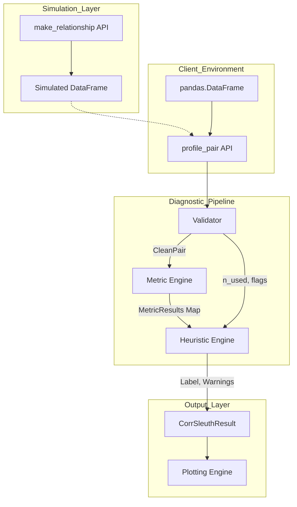

## 1. Feature Overview
CorrSleuth is a diagnostic engine for pandas users that interprets statistical associations through a "diagnostic panel" approach. It acts as an interpretive layer above standard metric calculators, identifying non-linear or non-monotonic signals that a standard correlation matrix obscures, and translates these findings into actionable heuristics and visual diagnostics.

## 2. Requirements Breakdown
* **Functional:** * Calculate core (Pearson, Spearman, Kendall) and optional metrics (Distance Correlation, Mutual Information).
  * Apply an 8-level heuristic priority cascade to assign a primary diagnostic label.
  * Return a highly inspectable `CorrSleuthResult` object with `.summary()`, `.explain()`, and `.plot()` methods.
* **Non-Functional:** * Ensure `lite` mode processes 100,000 rows in < 2 seconds.
  * Maintain strict optional dependency boundaries using lazy loading via `corrsleuth[standard]`.
* **Edge Cases:** * **High Missingness:** > 50% missing data triggers a warning; overrides to `low_power_or_uncertain` only if `n_used < 30`.
  * **High Ties/Discreteness:** Unique ratio < 0.05 appends a rank-metric instability warning without overriding the primary pattern.
  * **Conflicting Directionality:** `sign(pearson) != sign(spearman)` with both `|r| > 0.3` appends a warning but does not alter the primary label.

## 3. Component & System Interaction


* **Data Flow:** The simulator sits adjacent to the pipeline, feeding test data directly into the API early in the lifecycle. Raw data passes through the Validator to generate a `CleanPair` data contract. The Metric Engine computes absolute strengths and passes them to the Heuristic Engine, which evaluates gaps (`rank_linear_gap`, `nonmonotonic_gap`) alongside validation flags to produce the `CorrSleuthResult`.
* **Integration Points:** SciPy and NumPy for core metrics; Matplotlib for diagnostics; `dcor` and `scikit-learn` dynamically invoked for standard modes.

## 4. Implementation Steps (Phased)

### Phase 1: Foundations
* **Project Setup:** Initialize `pyproject.toml` with explicit extras:
  ```toml
  [project.optional-dependencies]
  standard = ["dcor", "scikit-learn"]
  ```
* **Contracts:** Define `CleanPair`, `MetricResult`, `HeuristicResult`, and `CorrSleuthResult` schemas.
* **Simulator Core:** Implement `make_relationship()` immediately to generate the 6 canonical shapes (`linear_positive`, `linear_negative`, `monotonic_log`, `u_shape`, `outlier_driven`, `independent`) for downstream test-driven development.

### Phase 2: Core Logic
* **Validator & Lite Metrics:** Build the data sanitization layer to drop missing values pairwise, compute unique ratios, and calculate Pearson, Spearman, and Kendall.
* **Standard Mode & Downsampling:** Dynamically load `dcor`/`sklearn`. If `mode="standard"` and `n_used > 20_000`, automatically downsample to 20k rows (appending a warning) unless `max_n_for_dcor=None` is explicitly passed.
* **Heuristic Engine (Pseudocode):**
  ```text
  FUNCTION apply_heuristics(metrics: MetricResultMap, flags: list, n_used: int):
      p = abs(metrics.pearson.value or 0)
      s = abs(metrics.spearman.value or 0)
      k = abs(metrics.kendall.value or 0)
      dc = metrics.distance_correlation.value if metrics.distance_correlation.available else None
      
      rank_linear_gap = abs(p - s)
      nonmonotonic_gap = (dc - max(p, s)) if dc is not None else 0
      
      IF "low_n" in flags or n_used < 30:
          RETURN "low_power_or_uncertain"
      IF p > 0.50 and (p - s > 0.20 or p - k > 0.25):
          RETURN "possible_outlier_or_leverage"
      IF dc is not None and p < 0.25 and s < 0.25 and dc > 0.35:
          RETURN "nonmonotonic_dependence"
      IF s > 0.50 and (s - p > 0.20):
          RETURN "monotonic_nonlinear"
      IF p > 0.50 and s > 0.50 and rank_linear_gap < 0.15:
          RETURN "near_linear"
      IF p < 0.20 and s < 0.20 and (dc is None or dc < 0.20):
          RETURN "weak_or_no_relationship"
      RETURN "mixed_or_ambiguous"
  ```

### Phase 3: UI/Client (If applicable)
* **Plotting Engine:** Implement `.plot(show=False)`. Must strictly `RETURN fig, axes`. Suppress `plt.show()` unless explicitly overridden.
* **Explanations:** Map the primary label to the 2-3 sentence narrative string.
* **Documentation:** Add quickstart example in the README demonstrating `make_relationship` -> `profile_pair` -> `.explain()`.

### Phase 4: Observability & Security
* **Guardrails:** Raise `OptionalDependencyError` when `standard` mode is invoked without required packages.
* **Disclaimers:** Implement default, suppressible causal caveats in `.explain(include_caveat=True)` and `.summary(include_caveat=True)`.

### Phase 5: Testing Strategy
* **Canonical Stability:** Use `pytest.mark.parametrize` with the 6 canonical shapes and fixed `random_state=42` to assert absolute label stability.
* **Property Tests:** For non-canonical shapes, assert mathematical relationships (e.g., $dCor > Pearson$) rather than brittle string matches.
* **Performance Benchmarks:** Add a CI step asserting the 100k-row `lite` mode execution falls under the 2-second threshold.

## 5. Dependencies & Risks
* **Assumptions:** Data inputs are strictly numeric pandas Series. Categorical variables are out of scope for v0.1 and will trigger a fatal validation error.
* **Risks:** The $O(n \log n)$ to $O(n^2)$ complexity of distance correlation algorithms. Mitigated by the 20,000-row automatic downsampling safeguard.

## 6. T-Shirt Size Estimate
**M** - By re-sequencing the simulator to Phase 1, solidifying the explicit heuristic thresholds, and establishing safe testing parameters, the architectural ambiguity is resolved. The path to execution is clear and constrained.
