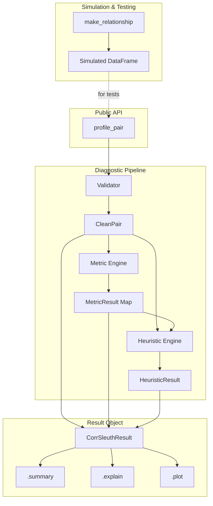

# Technical Architecture Specification: CorrSleuth v0.1 (Final)

**1. Architecture Overview**
[cite_start]**CorrSleuth** is a diagnostic engine for pandas users designed to interpret statistical associations through a "diagnostic panel" approach[cite: 2, 4]. [cite_start]The system follows a **linear processing pipeline** where raw numeric data is validated, transformed into internal data contracts, analyzed via a multi-metric engine, and finally categorized by a heuristic classifier[cite: 2, 3]. [cite_start]This architecture prioritizes "Lightweight First" principles by using **lazy optional dependency loading**—only invoking computationally expensive libraries like `dcor` or `scikit-learn` when explicitly requested in "standard" mode[cite: 2, 3].

---

**2. System Architecture Diagram**

---

**3. Component Breakdown**

| Component | Module Path | Responsibility |
| :--- | :--- | :--- |
| **Public API** | `corrsleuth/api.py` | [cite_start]Orchestrates the `profile_pair` pipeline and handles user parameters[cite: 2, 3]. |
| **Input Validator** | `corrsleuth/validation/` | [cite_start]Sanitizes inputs, handles missingness, and flags ties/constant columns into `CleanPair`[cite: 2]. |
| **Metric Engine** | `corrsleuth/metrics/` | [cite_start]Computes Pearson, Spearman, and Kendall (Core) plus DistCorr and MI (Optional)[cite: 2, 3]. |
| **Heuristic Engine**| `corrsleuth/heuristics/` | [cite_start]Applies 8-level priority rules to assign labels and generates diagnostic narratives[cite: 2, 3]. |
| **Plotting Engine** | `corrsleuth/plotting/` | [cite_start]Generates scatter and rank-rank panels, returning Matplotlib Figure objects[cite: 2]. |
| **Simulator** | `corrsleuth/datasets/` | [cite_start]Provides deterministic relationship generation (e.g., U-shape, linear) for testing[cite: 2, 3]. |

---

**4. Data Flow & Contracts**

Internal data movement is governed by strictly typed structures to ensure interpretability and ease of testing.

**Internal Contract: `CleanPair` (Dataclass)**
* [cite_start]`x`, `y`: Preprocessed pandas Series (pairwise dropped)[cite: 2].
* [cite_start]`metadata`: Dictionary containing `n_original`, `n_used`, and `missing_ratio`[cite: 2].
* [cite_start]`flags`: List of machine-readable state indicators (e.g., `high_missingness`, `low_unique_ratio`)[cite: 2].

**Internal Contract: `MetricResult` (Dataclass)**
* [cite_start]`name`: Metric identifier[cite: 3].
* [cite_start]`value`: Float coefficient or `None` if computation fails/is skipped[cite: 3].
* [cite_start]`available`: Boolean indicating if the required dependency was present[cite: 3].

**Internal Contract: `HeuristicResult` (Dataclass)**
* [cite_start]`label`: Primary diagnostic label (e.g., `monotonic_nonlinear`)[cite: 2, 3].
* [cite_start]`disagreement_components`: Map containing `rank_linear_gap` and `nonmonotonic_gap`[cite: 3].
* [cite_start]`recommendations`: List of actionable next steps for the analyst[cite: 2, 3].

---

**5. External Integrations**

| Integration | Purpose | Performance Notes |
| :--- | :--- | :--- |
| **Pandas/NumPy** | Data structure core | [cite_start]Highly efficient memory-bound operations[cite: 2]. |
| **SciPy** | Core Statistics | [cite_start]Deterministic, low overhead local execution[cite: 2]. |
| **Matplotlib** | Visual Diagnostics | [cite_start]Required for `.plot()`; supports Jupyter inline rendering[cite: 2]. |
| **scikit-learn** | Mutual Information | [cite_start]Optional; moderate overhead on large datasets[cite: 2, 3]. |
| **dcor** | Distance Correlation | Optional; [cite_start]$O(n \log n)$ complexity; high overhead[cite: 2, 3]. |

---

**6. Non-Functional Requirements**

* [cite_start]**Performance:** `mode="lite"` must process 100k rows in < 2 seconds[cite: 2].
* [cite_start]**Safety:** Every output from `.explain()` must include a non-causal disclaimer by default[cite: 2, 3].
* [cite_start]**Observability:** Explicit warnings must be raised for unique ratios < 0.05 or missingness > 50%[cite: 2].
* [cite_start]**Stability:** Canonical simulations with fixed `random_state` must yield 100% consistent labels in CI[cite: 2].
* [cite_start]**User Feedback:** If a metric in `standard` mode is missing a dependency, the system must raise `OptionalDependencyError` with install instructions[cite: 2].

---

**7. Technical Enablers**

* **Error Taxonomy:**
    * [cite_start]`InputError`: Raised for infinite values or non-numeric inputs[cite: 2].
    * [cite_start]`OptionalDependencyError`: Raised when `standard` mode is called without `dcor` or `sklearn`[cite: 2].
* **Testing Matrix:**
    * **Unit Tests:** Validate individual metric outputs against SciPy benchmarks.
    * [cite_start]**Heuristic Tests:** Ensure `u_shape` simulations map to `nonmonotonic_dependence`[cite: 2].
* [cite_start]**Packaging:** `pyproject.toml` with `standard` and `all` extra dependency groups[cite: 2, 3].

---

**8. High-Level Feature Map**

| Feature | Component | PRD Reference |
| :--- | :--- | :--- |
| Pairwise Profiling | `api.profile_pair` | [cite_start]FR-001 [cite: 2] |
| Priority Heuristics | `heuristics.classifier` | [cite_start]FR-001 (Priorities 1-8) [cite: 2] |
| Diagnostic Plots | `plotting.pairplot` | [cite_start]FR-002 (.plot method) [cite: 2] |
| Explanation Engine | `heuristics.explanations`| [cite_start]FR-002 (.explain method) [cite: 2] |
| Relationship Simulator| `datasets.simulations` | [cite_start]US-003 [cite: 2] |

---

**9. Risks, Assumptions & Open Questions**

* **Risk (Performance):** Distance correlation may hang on very large datasets ($N > 100k$). *Mitigation:* Implement a sample-size warning or optional cap in v0.1.
* **Risk (Causality):** Users may misinterpret "Strong Relationship" as causality. [cite_start]*Mitigation:* Cautious narrative language ("Evidence consistent with") and mandatory footer disclaimers[cite: 2, 4].
* [cite_start]**Assumption:** Version 0.1 assumes numeric-only inputs; categorical support is strictly out of scope[cite: 2, 4].
* [cite_start]**Open Question:** Should `mutual_information` be moved to core dependencies if `scikit-learn` is already common in the target user's environment?[cite: 3].

---

**10. T-Shirt Size Estimate**

**L (Large)**
[cite_start]While the core metrics are commodity, the complexity of a deterministic relationship simulator (14+ types), a robust rule-based heuristic engine with 8 priority levels, and a multi-panel diagnostic plotting suite makes this a significant engineering undertaking for a v0.1 release[cite: 2, 3].